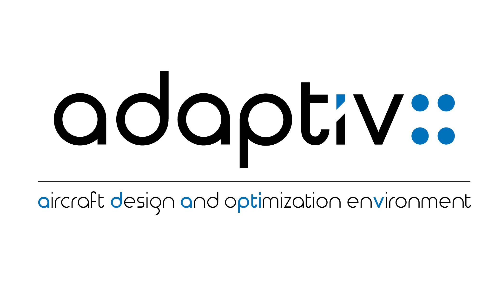

## References & guides

1. Git cheat sheet for quick reference of commonly used command line instructions

1. C++ book guide (WIP)
    * **Bigginer introduction**
        1. [Programming: Principles and Practice Using C++](https://www.amazon.com/dp/0321992784/)
    * **Standard Template Library**
        1. Containers
        1. Iterators
        1. Algorithms
1. Google C++ testing framework

## Planning

1. Core math library
    * MKL and/or cuBLAS wrapper
    * Check implementations of current math libraries (_e.g._  [Eigen](http://eigen.tuxfamily.org))
    * N-dimentional arrays:
        * [A Class Template for N-Dimensional Generic Resizable Arrays](http://www.drdobbs.com/a-class-template-for-n-dimensional-gener/184401319)
        * [LibFlatArray](http://www.libgeodecomp.org/libflatarray.html)
##
